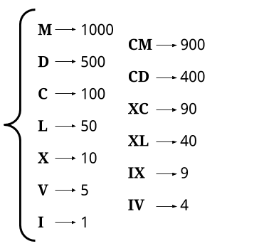

# 12: Integer to Roman

### Roman to Integers

### Solution 1: Brute Force
The largest number can be represented in Roman notation is **3999 (MMMCMXCIX)**, so the input size is a constant value.

**Time Complexity:** `O(1)`.

**Space Complexity:** `O(1)`.

### Solution 2: Concise
The largest number can be represented in Roman notation is **3999 (MMMCMXCIX)**, so the input size is a constant value.

**Time Complexity:** `O(1)`.

**Space Complexity:** `O(1)`.

### Related
12: Integer to Roman.

13: Roman to Integer.

273: Integer to English Words.