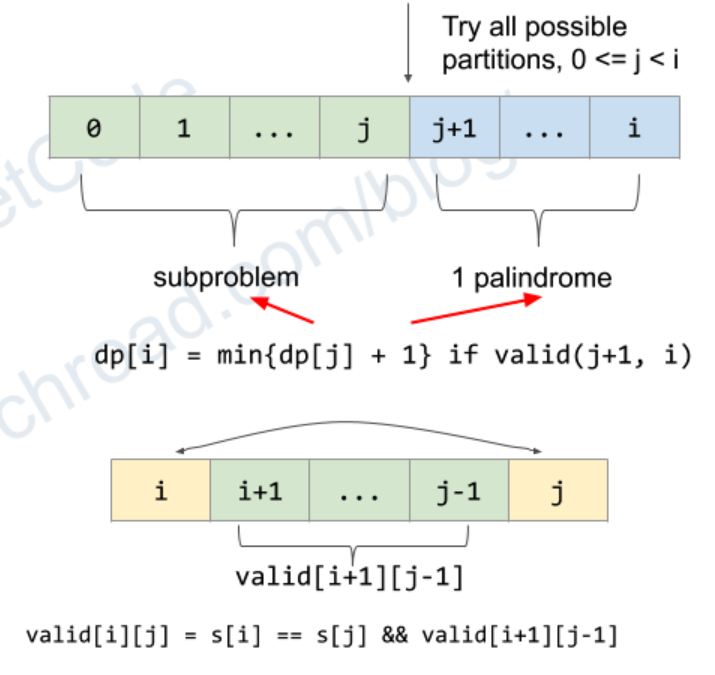

# 132: Palindrome Partitioning II
### Solution: DP
`dp[i]`: minimum cuts needed for substring `[0, i]`.

**Recurrence Relation:** `dp[i] = min(dp[i], dp[j]+1) if valid[j+1][i]`.

**Time Complexity:** `O(N * N)`.

**Space Complexity:** `O(N * N)`.

Reference: [Huahua](https://zxi.mytechroad.com/blog/dynamic-programming/leetcode-132-palindrome-partitioning-ii/).

### Related
131: Palindrome Partitioning.

132: Palindrome Partitioning II.