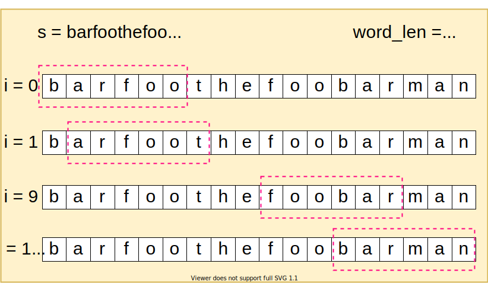

# 30: Substring with Concatenation of All Words

### Solution: Sliding Window
The idea is we keep getting a fixed window size from `s` every time, compare the word count of the window with `words` count. If they match, we find an index. 

**Time Complexity:** `O(M * N)`, `M` is the length of `s`, `N` is the total words' length of `words`.

**Space Complexity:** `O(N)`.

### Related
30: Substring with Concatenation of All Words.

76: Minimum Window Substring.

438: Find All Anagrams in a String.

567: Permutation in String.

727: Minimum Window Subsequence.