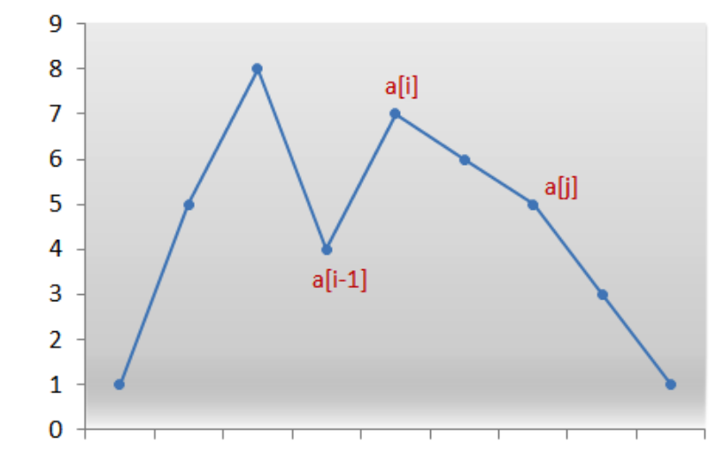

# 31. Next Permutation

### Solution: Math
From [Wikipedia](https://en.wikipedia.org/wiki/Permutation#Generation_in_lexicographic_order), actual implementation see code comments.

For reference:

**Time Complexity:** `O(N)`.

**Space Complexity:** `O(1)`.

### Related
31: Next Permutation.

46: Permutations.

47: Permutations II.