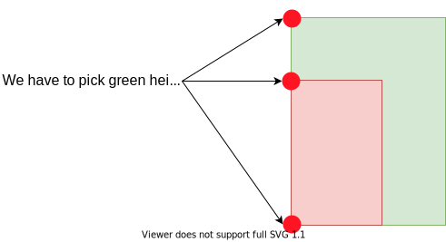
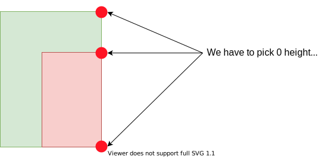

# 218; The Skyline Problem

### Solution: Sweep Line
There has 2 key steps to solve this problem. The 1st step is transforming each building coordinate into a pair and sorting them. The 2nd step is using sweeping line to scan these pair and find the **key points**.

### Step 1: Transforming + Sorting
For a building coordinate, we have to transform it:
```
buildings[i] = [left_i, right_i, height_i] => [left_i, height_i] and [right_i, height_i]
```
So we transformed each rectangle into a single vertical line. A thing need to note here is we have to distinguish these lines, i.e. left line and right line of the rectangles. So we will:
```
left side: [x, -h], mark left height as negative value.
right side: [x, h], mark right height as positive value.
```
Then, we have to sort these lines based on the `x` coordinates. There has two case need to consider when the lines have the same `x` point.

1.If the left side has same `x`, we are **entering** a building in this case, for example:



2.If the right side has same `x`, we are **leaving** a building in this case, for example:



### Step 2: Sweep Line Scan
We use a priority queue to maintain current max height we have seen so far. In the meantime, we have to use `prevMax` to track previous max height. If we encounter a new line, it can be entering or leaving a building, we have to check `curMax` height is equal to `prevMax` or not. If not, it means we meet a key point so add it to the answer.

**Time Complexity:** `O(N * logN)`.

**Space Complexity:** `O(N)`.


