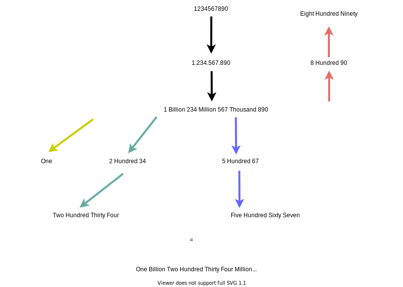

# 273: Integer to English Words

### Solution: Recursion

**Time Complexity:** `O(N)`.

**Space Complexity:** `O(1)`.

### Related
12: Integer to Roman.

13: Roman to Integer.

273: Integer to English Words.