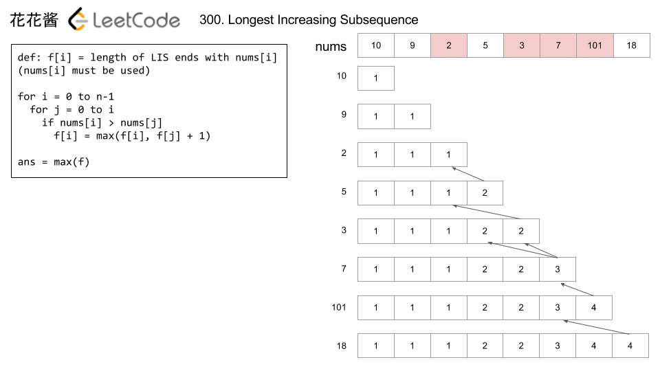

# 300: Longest Increasing Subsequence

Reference: [Huahua](http://zxi.mytechroad.com/blog/dynamic-programming/leetcode-300-longest-increasing-subsequence/).

Related:

128: Longest Consecutive Sequence.

300: Longest Increasing Subsequence.

673: Number of Longest Increasing Subsequence.

674: Longest Continuous Increasing Subsequence.