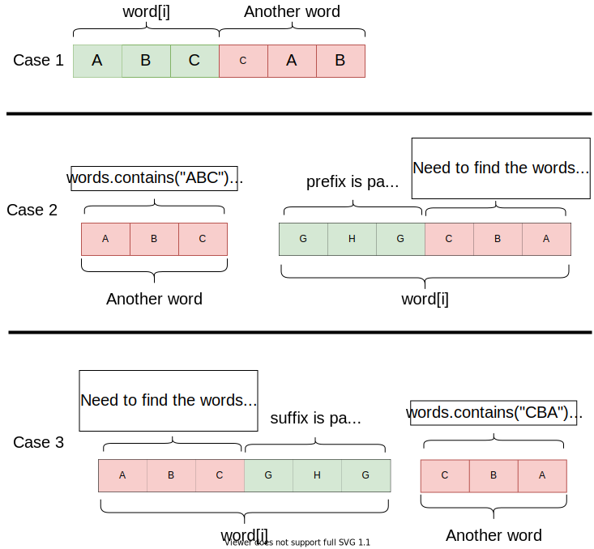

# 336: Palindrome Pairs
See explanation:

**Time Complexity:** `O(k^2 * N)`, `N` is the length of the `words`, `k` is the length of each `word`. Traverse `words` take `O(N)`. In each iteration, we build `palindromeSuffixes` and `palindromePrefixes`, and in each `prefix` and `suffix` we need to check it is a palindrome, so it takes `O(k^2)`.

**Space Complexity:** `O(N)`. We need a hashtable to store the `word->index` mapping.