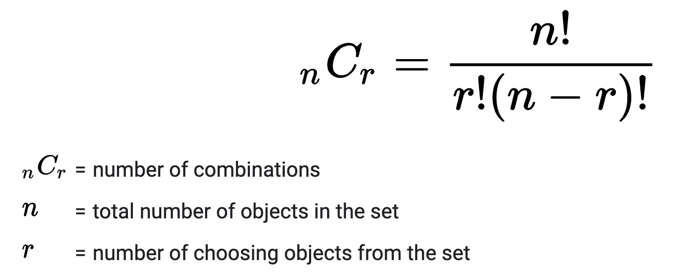

# 750: Number Of Corner Rectangles

### Solution 1: Brute Force
**Time Complexity:** `O(M^2 * N^2)`.

**Space Complexity:** `O(1)`.

### Solution 1: Fixed Row Scan by Column
The idea is fix tow rows, scan by the column and count `1` in both rows. Then use combination logic select 2 from `count` to find corner rectangles.

**Time Complexity:** `O(M^2 * N)`.

**Space Complexity:** `O(1)`.
