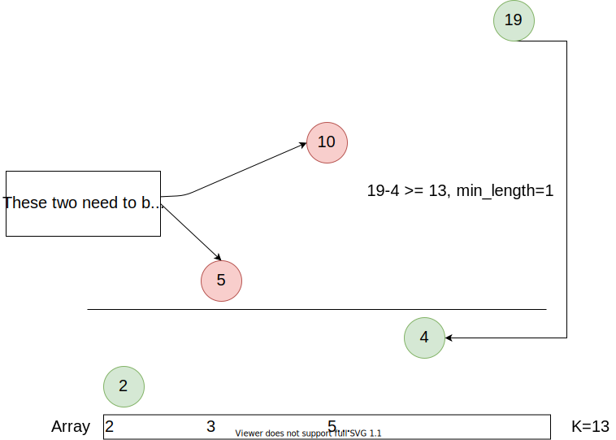

# 862: Shortest Subarray with Sum at Least K

### LC209 and LC862 Difference
Both 209 and 862 asks to find a contiguous subarray's sum >= K. However, LC209 only has positive numbers but LC862 has a mix of positive and negative numbers.

In an interview, the 862 could be treated as a follow up.

### Solution 1 vs Solution 2
In essence, solution 1 and solution 2 are same, they both maintain a **monotonic increasing subsequence.**

### Solution 1: prefixSum + TreeMap
The key points in this solution is how to remove entries from TreeMap. Consider `prefixSum[j]` at position `j`, there has a `prefixSum[i]` that meets `prefixSum[i] > prefixSum[j]` where `i < j`. Whenever we find a `prefixSum[k] - K` that maybe both `prefixSum[i]` and `prefixSum[j]` are meets:
```
prefixSum[k] - K >= prefixSum[i];
prefixSum[k] - K >= prefixSum[j];
```
But since `prefixSum[i] > prefixSum[j]` so calling `floorEntry` will return `(prefixSum[i], i)`. So the length `k-i` is not the minimal length, and we have to remove it.

**Time Complexity:** `O(N * logN)`.

**Space Complexity:** `O(N)`.

### Solution 2: Monotonic Queue
For example, consider an array `[2,3,5,-6,15]`, `K=13`:



**Time Complexity:** `O(N)`.

**Space Complexity:** `O(N)`.

### Related:
209: Minimum Size Subarray Sum.

325: Maximum Size Subarray Sum Equals k.

560: Subarray Sum Equals K.

862: Shortest Subarray with Sum at Least K.