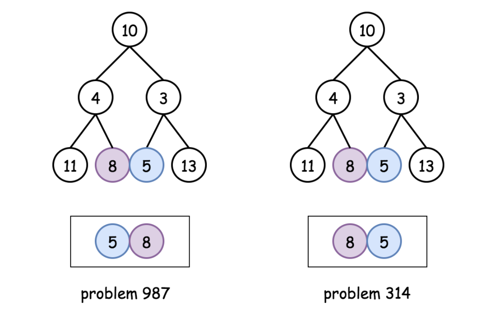

# 987: Vertical Order Traversal of a Binary Tree

### Difference Between 314 and 987
The main difference is when **two nodes comes in same position:**

314: the order is decided by X coordinates.

987: the order is decided by their values.

### Solution 1: BFS
Same as LC314 logic. Traverse the tree in level order, and store each node's column number and itself into Map.

**Time Complexity:** `O(N * K * logK)`, `N` is the number of nodes, `K` is the number of column. `Collections.sort()` takes `O(K * logK)`. Traverse the tree takes `O(N)` time.

**Space  Complexity:** `O(N)`.

### Solution 2: DFS + Sorting
DFS traverse all nodes and push them into a list. Using 3-dimensional sorting (column based) and build the result finally.

**Time Complexity:** `O(N * logN)`. Sort all nodes takes `O(N * logN)`.

**Space  Complexity:** `O(N)`.

### Related
102: Binary Tree Level Order Traversal.

103: Binary Tree Zigzag Level Order Traversal.

107: Binary Tree Level Order Traversal II.

314: Binary Tree Vertical Order Traversal.

429: N-ary Tree Level Order Traversal.

987: Vertical Order Traversal of a Binary Tree.