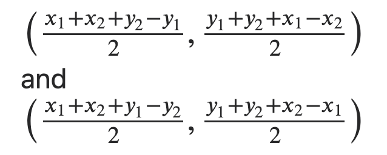

# Detect Square in Stream
Question: [Link](https://leetcode.com/discuss/interview-question/1382025/Google-phone-screen).

You are receiving a stream of integer coordinates, with each new input you need to figure out if it forms a square with any set of points which is already processed?

### Solution
Background: Given any two points, if these two points are connecting one diagonal of a square then we can find the other two vertices of the square using [formula](https://www.quora.com/Given-two-diagonally-opposite-points-of-a-square-how-can-I-find-out-the-other-two-points-in-terms-of-the-coordinates-of-the-known-points/answer/Prateek-Karandikar?ch=10&share=6ae13061&srid=1Squ).

The solution quite simple: keep all incoming points in a visited sets and when a new point coordinates coming in, iterate existing visited set and pick a point one by one to find the other missing vertices using above formula.
Find these calculated vertices exist in the visited set or not.
