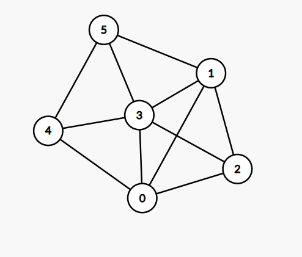

# Triangles in graph
Question: [Link](https://leetcode.com/discuss/interview-question/305644/google-onsite-triangles-in-graph).

Given n nodes and edges of an undirected graph. How many triangles are there in this graph? Triangle is a cycle of length 3.

Example 1:
```
Input: n = 6, edges = [[0,1], [3,0], [0,2], [3,2], [1,2], [4,0], [3,4], [3,5], [4,5], [1,5], [1,3]]
Output: 7
```
