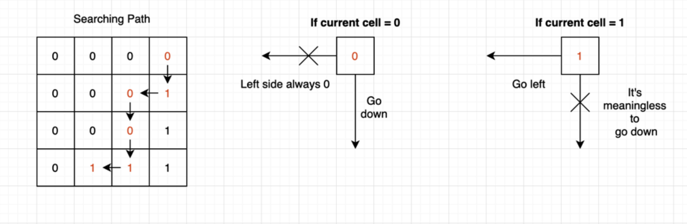

# N Sum
1 (2 sum, array not sorted), 167 (2 sum, sorted array).

# Maximum Subarray 
Using Kadane's algorithm: 53 (regular array), 918 (circular array)

# H-Index
274 (array not sorted), 275 (array sorted, using binary search)

# Array Item in the Range
Make use of `1 ≤ a[i] ≤ n` (n = size of array).

448 (Easy): find missing numbers.

442 (Medium): find duplicates.

# Smart Search in 2D Array
1428 (Medium):

# Trap Water
11 (Medium): using two pointer.

42 (Hard): solve in O(N) time complexity.