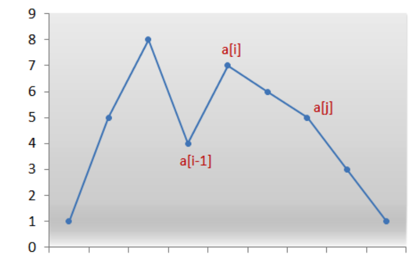

# Permutations
46 (Medium): Permutations.

47 (Medium): Permutations II.

31 (Medium): Next Permutations, need to use some trick here.

60 (Hard): Permutation Sequence, need to use some trick here.

# Combinations
77 (Medium): Combinations.

39 (Medium): Combination Sum.

