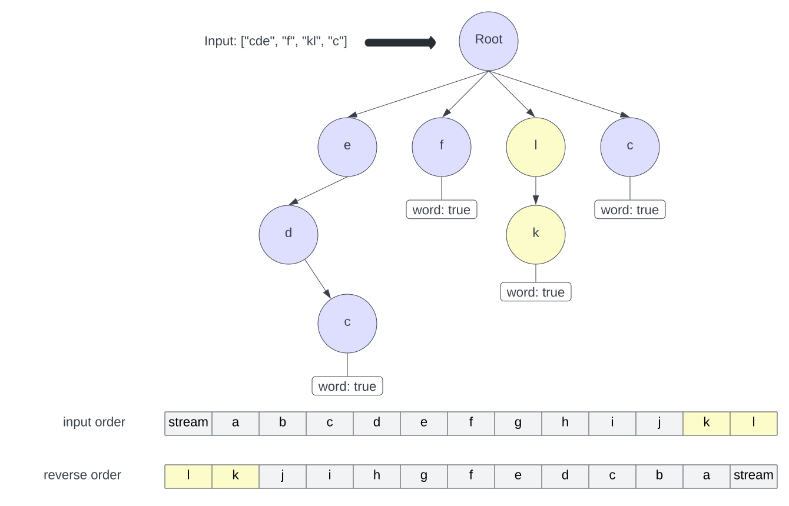

# 1032: Stream of Characters

### Solution 1: Brute Force - TLE
**Time Complexity:** `query(char letter)` takes `O(N * W)` in worst case. `N` is the number of words and `W` is the maximum length of the all word.

**Space Complexity:** `O(N)`.

### Solution 2: Trie
The whole motivation is we only need to search the suffix from the **last character** of the stream, thus it gives an idea to build a trie of the **reversed** words, and then try to match the **reversed** stream of characters.

**Time Complexity:** `query(char letter)` takes `O(W)` where `W` is the max word length, i.e. the depth of the trie.

**Space Complexity:** `O(W)`.
