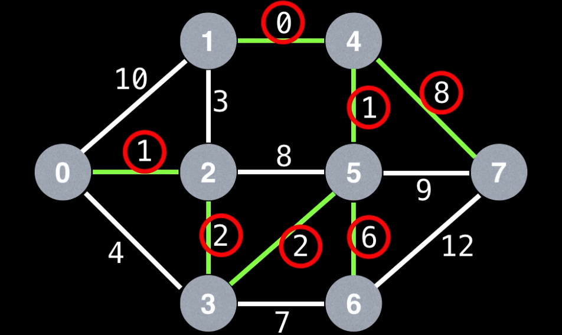

# 1135: Connecting Cities With Minimum Cost

### Solution 1: Prim's Minimum Spanning Tree
The idea is we use a PriorityQueue and always poll out the minimum cost edge first. Then start with the minimum cost node, we push all the outward edges from the current node into the queue. Keep doing it to make sure all nodes are visited in the end. 

Reference: [WilliamFiset](https://www.youtube.com/watch?v=jsmMtJpPnhU&ab_channel=WilliamFiset).

Time Complexity: `O(E * logE)`, `E` is the number of edges. Because we are adding all edges into PriorityQueue in the worst case, and each operation takes `logE`, so overall is `O(E * logE)`.

Space Complexity: `O(E)`, `E` is the number of edges.

### Solution 2: Union Find Kruskal's Algorithm
**Step 1:** sort edge cost in ascending order. 

**Step 2:** Pick the minimum cost edge first, then connect both nodes using union find. If they can be connected, add the cost to result, if not, skip it.

Time Complexity: `O(E * logE)`, `E` is the number of edges. `Arrays.sort(Object[])` is based on the TimSort algorithm, giving us a time complexity of `O(N * log(N))`.

Space Complexity: `O(E)`, `E` is the number of edges.