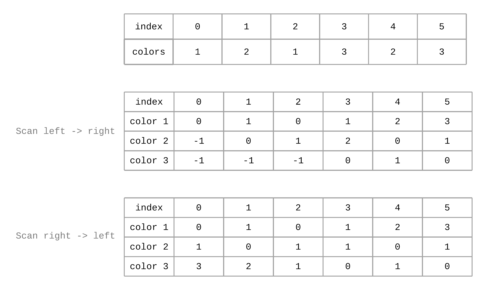

# 1182: Shortest Distance to Target Color

### Solution 1: Binary Search
Given input `[2,1,2,2,1]`, the map will be like:
```
1: {1, 4}.
2: {0, 2, 3}.
3: {};
```
Given query like `[2, 1]`, trying to find the nearest `1` from index `2`, so will pick list `{1, 4}`. The binary search logic will like
```
left = 0, right = 1, mid = 0;
left = 1, right = 1, mid = 1;
```
In this case, `list.get(left) = 4` is not the nearest position, index `1` is the right nearest, i.e. `list.get(left-1)`. 
So we have to compare the distance between `start` with `list.get(left)` and `start` with `list.get(left-1)`.

**Time Complexity:** `O(QlogN + N)`, `Q` is the length of the queries, `N` is the length of the `colors`. 
Initialization takes `O(N)` time and each query binary search takes `logN` time, so total is `O(QlogN)`.

**Space Complexity:** `O(N)`.

### Solution 2: Two Way Scan
Scan left -> right, find the shortest distance between the current index to the most left color. 
Scan right -> left, find the shortest distance between the current index to the most right color. In the meantime, find the minimum distance.

Example:


**Time Complexity:** `O(N + Q)`, `Q` is the length of the queries, `N` is the length of the `colors`.

**Space Complexity:** `O(N)`.