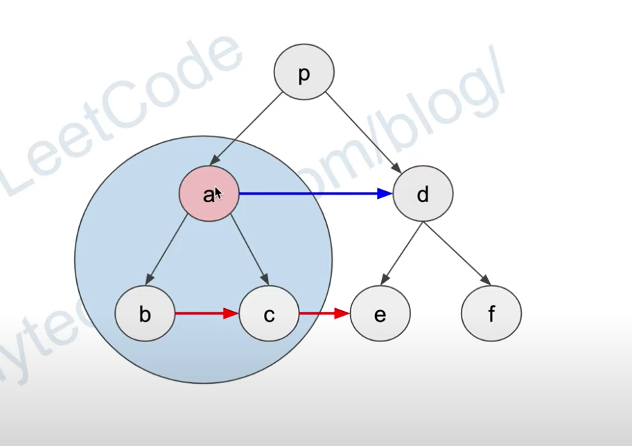

# 116: Populating Next Right Pointers in Each Node

### Solution 1: BFS
Time Complexity: `O(N)`. `N` is the number of nodes.

Space Complexity: `O(N)`. `N` is the number of nodes.

### Solution 2: DFS
Using `preOrder` traversal, Complexity analysis is same as Solution 1.

### Solution 3: Optimized DFS
For a given root node `a`, combine its child nodes is easy: `root.left.next = root.right`. In order to connect `c` and `e`, we have to use `a.next == d` as a bridge to access `e`, i.e. `root.right.next = root.next.left`. So we have to use `preOrder` traversal here. 

Reference: [Huahua](https://zxi.mytechroad.com/blog/tree/leetcode-116-populating-next-right-pointers-in-each-node/).

Time Complexity: `O(N)`. `N` is the number of nodes.

Space Complexity: `O(1)`.

### Related
116: Populating Next Right Pointers in Each Node.

117: Populating Next Right Pointers in Each Node II.
                                          