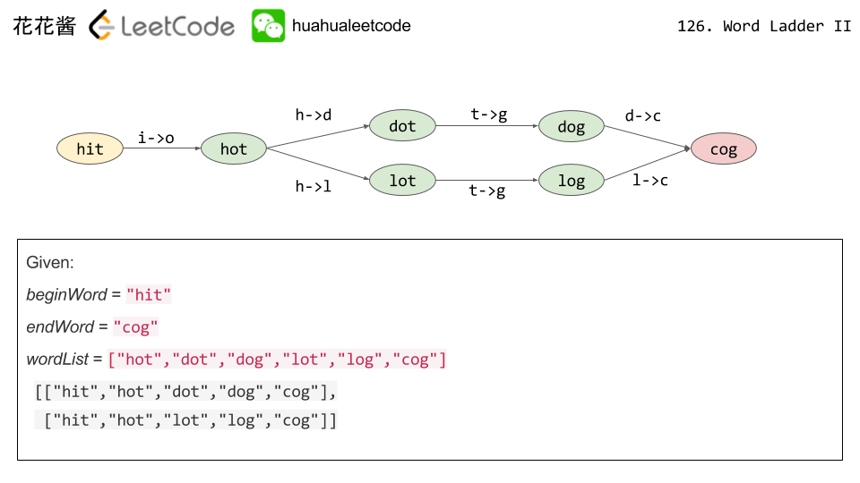
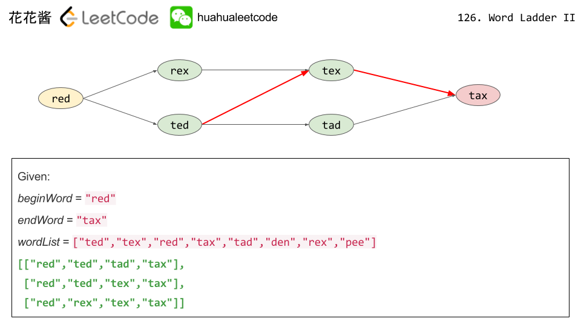

# 126: Word Ladder II
The idea is:
1. Use BFS to construct the graph.
2. Use DFS to extract the shorted path.

Example 1:

Example 2:

Reference: [Huahua](http://zxi.mytechroad.com/blog/searching/leetcode-126-word-ladder-ii/).

### Related
126: Word Ladder II.

127: Word Ladder.