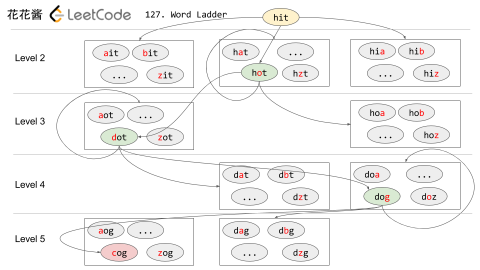

# 127: Word Ladder

### Solution 1: BFS
Recursion tree:

Reference: [HuaHua](https://zxi.mytechroad.com/blog/searching/127-word-ladder/).

**Time Complexity:** `O(M * N)`, `M` is the length of each word, `N` is the total number of words. For each word, we find intermediate word by iterating its length. There has `N` words, so it takes `O(M * N)`.

**Space Complexity:** `O(N)`.

### Solution 2: Bidirectional BFS
Sometimes does not need `Queue` in BFS, `Set` also works.

**Time Complexity:** `O(M * N)`, `M` is the length of each word, `N` is the total number of words. For each word, we find intermediate word by iterating its length. There has `N` words, so it takes `O(M * N)`.

**Space Complexity:** `O(N)`.

### Related
126: Word Ladder II.

127: Word Ladder.
