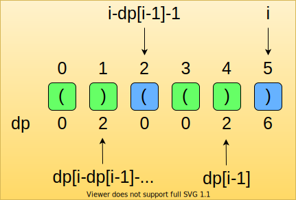

# 32: Longest Valid Parentheses

### Solution 1: DP
A valid parentheses must ends with `(`, so we use a `dp[i]` to specify the longest valid parentheses end with `i`.

Recurrence relations:
```
1. S[i] == '(': dp[i] = 0, since valid parentheses cannot end with '('.
2. S[i] == ')' && S[i-1] == '(': dp[i] = dp[i-2] + 2.
3. S[i] == ')' && S[i-1] == ')': we need to find S[i] cooresponding character which is S[i-dp[i-1]-1], determine S[i-dp[i-1]-1] == '('. If it is: dp[i] = 2 + dp[i-1] + dp[i-dp[i-1]-2]. 
```
See chart:



**Time Complexity:** `O(N)`.

**Space Complexity:** `O(N)`.

### Solution 2: Stack
The logic is:
* When meet `(`: We push its index `i` to the stack.
* When meet `)`: We pop an element from stack, get current valid parentheses using `i - stack.peek()`. An exception here is if we get empty stack after `pop`, we need to push current index `i` to the stack which means current `i` is a **split point**, valid parentheses is right after it. 

**Time Complexity:** `O(N)`.

**Space Complexity:** `O(N)`.

### Solution 3: Two Direction Scan
Get `max_length` from left -> right and then right -> left.

**Time Complexity:** `O(N)`.

**Space Complexity:** `O(1)`.

### Related
20: Valid Parentheses.

32: Longest Valid Parentheses.

1249: Minimum Remove to Make Valid Parentheses.