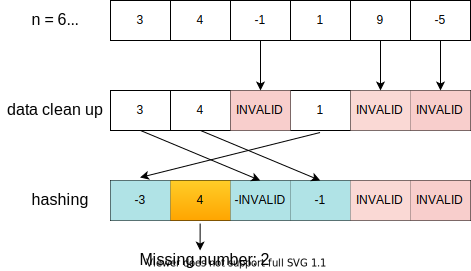

# 41: First Missing Positive

### Solution 1: Brute Force
Using a `Hashset` to record all the numbers we have seen so far. Then iterate from `1` to `n` to find first missing positive number.

**Time Complexity:** `O(N)`.

**Space Complexity:** `O(N)`.

### Solution 2: Index as Hash Key
The key observations here are: 
* For an array `nums` has length `n`, the first missing positive number must in the range of `[1, n]`.
* Any `0` and negative numbers in `nums` are not interested, so we should clean it up.

The logic is:

**Time Complexity:** `O(N)`.

**Space Complexity:** `O(1)`.

### Related
41: First Missing Positive.

268: Missing Number.