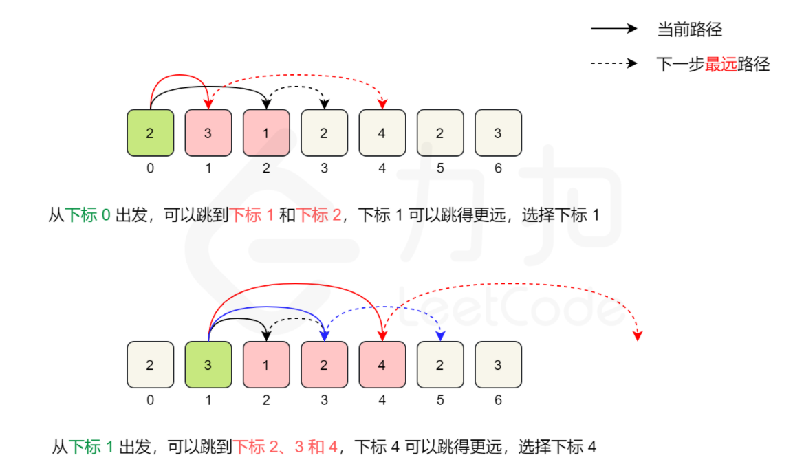

# 45: Jump Game II

### Solution 1: DP, causing TLE
Using same logic in LC55 `Solution_2`. Causing Time Limit Exceeded but enough for coding interview.

**Recurrence relation:** at any `end` position and any `start` position before `end`, `dp[end] = min(dp[end], dp[start]+1)` if `start + nums[start] >= end`.

**Time Complexity:** `O(N^2)`.

**Space Complexity:** `O(N^2)`.

### Solution 2: Greedy
**Logic:** we keep updating the `max_position` we can reach from any index `i` when iterating the array. Keep recoding the boundary `end` and when we reach `end`, updated it and `steps++`.

For input: `[2,3,1,1,4]`, the debug output looks like:
```
i=0 max_position=2 end=2 steps=1
i=1 max_position=4 end=2 steps=1
i=2 max_position=4 end=4 steps=2
i=3 max_position=4 end=4 steps=2
```



Reference: [LeetCode-cn](https://leetcode-cn.com/problems/jump-game-ii/solution/tiao-yue-you-xi-ii-by-leetcode-solution/).

**Time Complexity:** `O(N)`.

**Space Complexity:** `O(1)`.

### Related
55: Jump Game.

45: Jump Game II.

1306: Jump Game III.