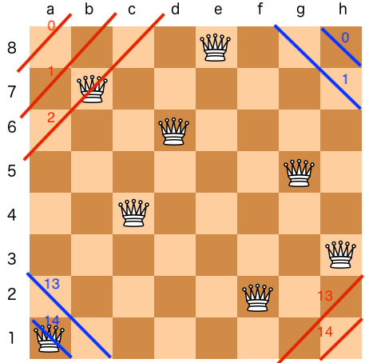

# 52: N-Queens II

How to determine the diagonal index:

red line: `index = row + col`, blue line: index = `row - col + n - 1`.

Related:

36: Valid Sudoku.

37: Sudoku Solver.

51: N-Queens.

52: N-Queens II.
