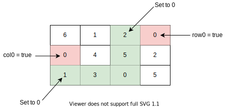

# 73: Set Matrix Zeroes

### Solution 1: Brute Force
**Time Complexity:** `O(M * N)`.

**Space Complexity:** `O(M * N)`.

### Solution 2: Constant Space
The idea is if any `matrix[r][c] == 0`, we know that in that row and column all cells will be set to 0. So we will use first element in that row and column to mark it, i.e.:
```
matrix[r][0] = 0;
matrix[0][c] = 0;
```
An exception need to handle is `0` row and `0` column, if any `matrix[r][0] == 0` or `matrix[0][c] == 0`, we need to set `0` row and `0` column to `0` accordingly.



**Time Complexity:** `O(M * N)`.

**Space Complexity:** `O(1)`.
