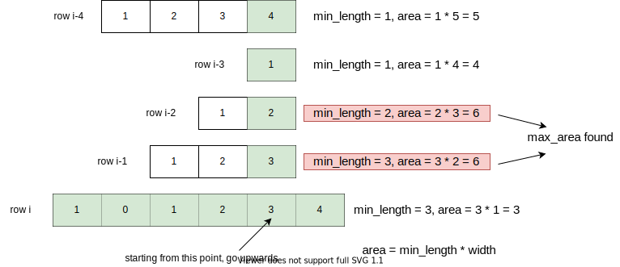

# 85: Maximal Rectangle

### Solution 1: DP
`dp[i]` means maximum continuous length in row `i`. For example, given a row after dp process it becomes:

Then from each point, we go upwards to find the minimum rectangle length `min_length` and update `max_area` at the same time:

**Time Complexity:** `O(rows^2 * cols)`.

**Space Complexity:** `O(rows * cols)`.

### Related
84: Largest Rectangle in Histogram.

85: Maximal Rectangle.