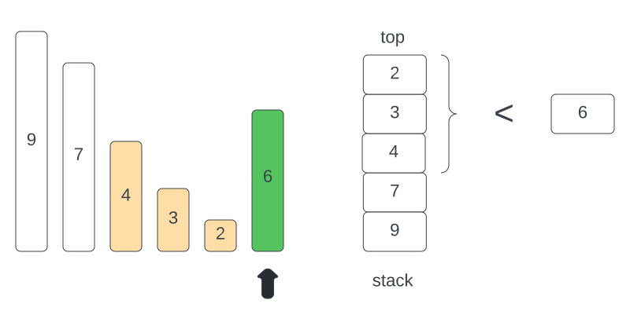

# 496: Next Greater Element I

### Solution 1: Brute Force
Using a hashmap to record the `nums2` index, then scan the `nums1` and find the next greater element by looking the map.

**Time Complexity:** `O(M * N)`.

**Space Complexity:** `O(N)`.

### Solution 2: Monotonic Stack
`Map` structure:  key -> `nums2[i]`, value -> `next greater element than nums2[i] in nums2`. To understand how monotonic queue works, for example given `nums2`: [9, 7, 4, 3, 2, 6] to find the next greater element in this array:
`9 -> 7 -> 4 -> 3 -> 2 ->` is a decreasing sequence, so it will be pushed to the stack. When scan to the number 6, it's larger than the top 3 numbers [2, 3, 4] so stack will keep pop these elements, so next greater element of [2, 3, 4] is 6.
.

**Time Complexity:** `O(N)`.

**Space Complexity:** `O(N)`.

### Related
496: Next Greater Element I.

503: Next Greater Element II.

556: Next Greater Element III.

739: Daily Temperatures.

907: Sum of Subarray Minimums.

2104: Sum of Subarray Ranges.
