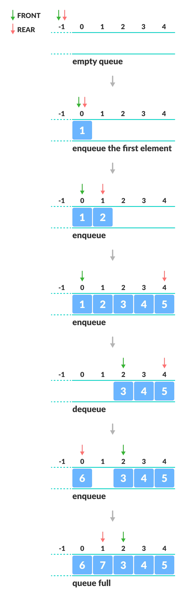

# 622: Design Circular Queue

### Solution 1: Array

**Time Complexity:** `O(1)`. All ops in circular queue take constant time.

**Space Complexity:** `O(N)`.

### Solution 2: Singly Linked List
**Time Complexity:** `O(1)`.

**Space Complexity:** `O(N)`.

### Related
622: Design Circular Queue.

641: Design Circular Deque.
