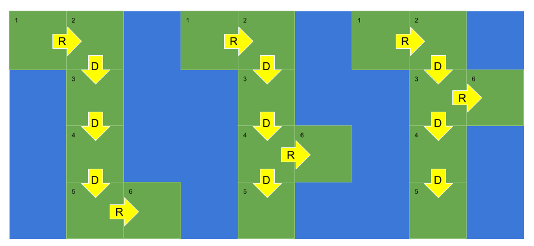

# 694: Number of Distinct Islands

### Solution 1: Hash by Path Signature
Using a `Set` to track all DFS search paths, the size of the `Set` is the number of distinct islands. The only thing need to note here is the following 3 paths will be encoded as `RDDDR`, so we need **backtrack**.

Reference: [LeetCode-694](https://leetcode.com/problems/number-of-distinct-islands/solution/).

**Time Complexity:** `O(M * N)`.

**Space Complexity:** `O(M * N)`.

### Solution 2: Hash by Cell Coordinates.
For same two islands, any cell row's difference and column's difference to its original point are same, so we use this feature to track the DFS path.

**Time Complexity:** `O(M * N)`.

**Space Complexity:** `O(M * N)`.

### Related
200: Number of Islands.

286: Walls and Gates.

323: Number of Connected Components in an Undirected Graph.

542: 01 Matrix.

547: Number of Provinces.

694: Number of Distinct Islands.

695: Max Area of Island.

994: Rotting Oranges.

1091: Shortest Path in Binary Matrix.

1254: Number of Closed Islands.

1730: Shortest Path to Get Food.

