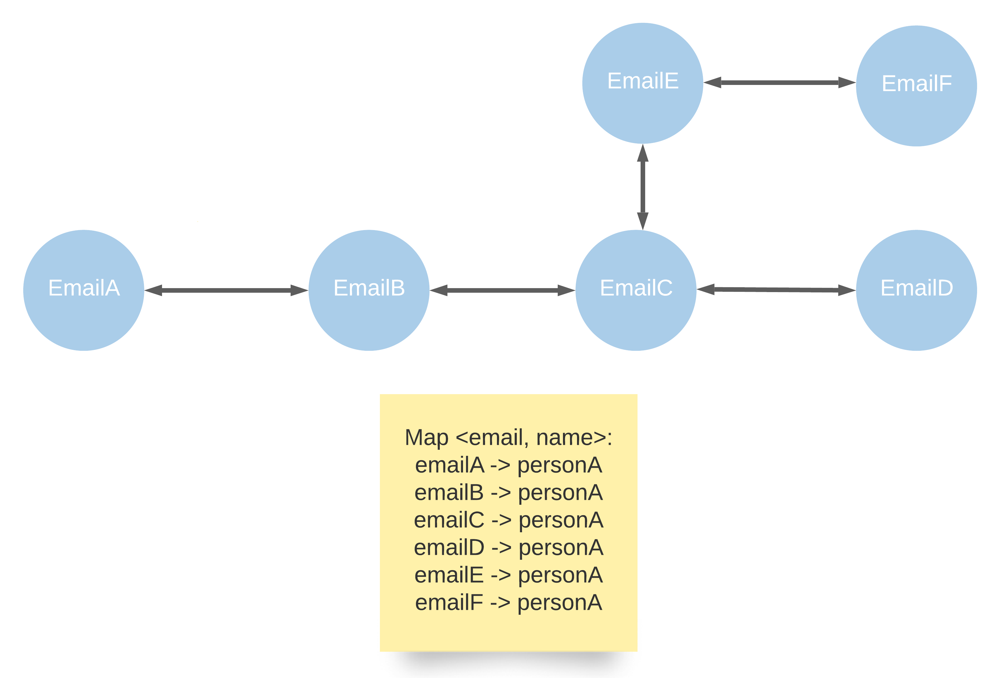

# 721: Accounts Merge

### Solution 1: DFS
Build a bidirectional graph that each node represents an email address, for example given `account[i]`: `["personA", "emailA", "emailB", "emailC", "emailD"]` and `account[i + 1]`: `["emailC", "emailE", "emailF"]`, it will be looks like:
.
Use a separate kay-value pair map `<email, name>` to store the email name mapping for final result.

**Time Complexity:** `O(N * K * log(N * K) + N * K)`. Assuming it has `N` accounts and each account has length of `K`, sorting `O(N * K * log(N * K))` time complexity and go through DFS takes `O(N * K)`.

**Space Complexity:** `O(N * K)`.

### Solution 2: Union Find
Step 1: build a union find that if index `account[i]` and `account[j]` can be merged, union find should `parents[i] = j` or `parents[j] = i` equivalent. Using a `emailIndex` map to track each email is belong to which account index.
If `account[i]` and `account[j]` shared one of the email address,then `union(i, j)`.

Step 2: based on the union find, merge each account email address.

Step 3: get each sorted merged email and return the result.

**Time Complexity:** `O(N * K * log(N * K) + N * K)`

**Space Complexity:** `O(N * K)`.
