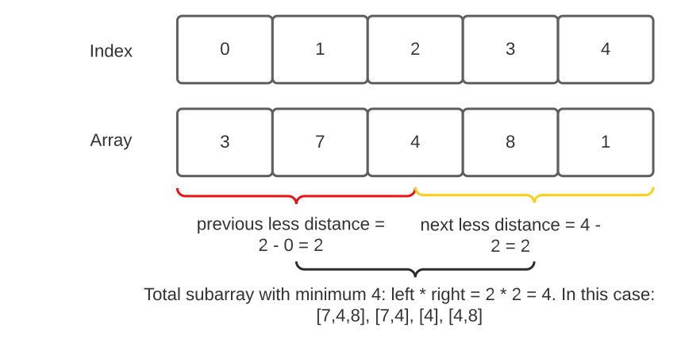

# 907: Sum of Subarray Minimums

### Solution 1: Brute Force - TLE
**Time Complexity:** `O(N ^ 2)`.

**Space Complexity:** `O(1)`.

### Solution 2: Monotonic Stack
The overall strategy is for every element in `arr`, assuming `arr[i]` is the minimum value, we need to find the total number of subarray that has `arr[i]` is the minimum value. 
So we should find `arr[i]` first left (previous) minimum element and first right (next) minimum element using monotonic stack. 
For example: given `[3, 7, 4, 8, 1]` and `arr[i] = 4`, the first left (previous) minimum element is `3` and the first right (next) minimum element is `1`. Using the distance to each left/right first minimum element we can know how many sub array has minimum with `arr[i] = 4`.

In this case, `[7,4,8]`, `[7,4]`, `[4]`, `[4,8]` is the sub array has minimum value `arr[i] = 4`. So the sum will be `4 * 4 = 16`.

Another thing to note here is, we should initialize the distance for first left (previous) and first right (next) minimum as `i + 1` and `n - i` respectively. 
For example `[1, 2, 3, 4]` array element `4` has no first left (previous) so the distance will be `i + 1 = 4`. And element `1` has no first right (next) so the distance will be `n - i = 4`.

**Time Complexity:** `O(N)`.

**Space Complexity:** `O(N)`.

### Related
496: Next Greater Element I.

503: Next Greater Element II.

556: Next Greater Element III.

739: Daily Temperatures.

907: Sum of Subarray Minimums.

2104: Sum of Subarray Ranges.
